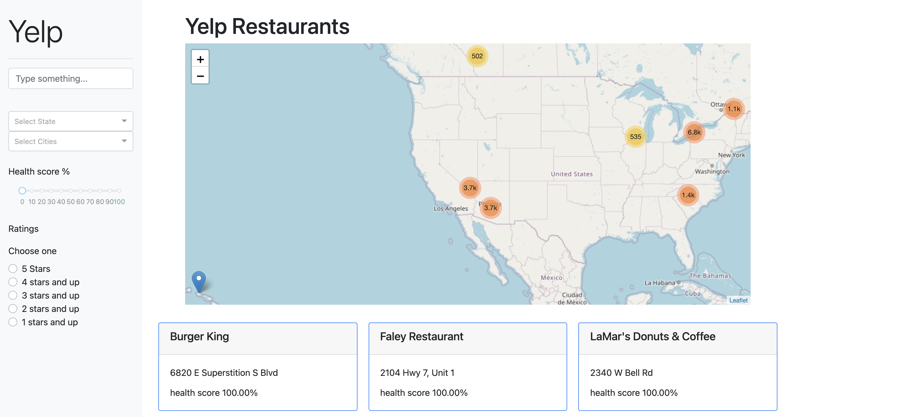

## How to Use Yelp_Recommendations

### Launching the App

To launch the app, run the following commands in the terminal:
```
    cd Yelp
    python app.py
```

You should now see the following UI:
```
Dash is running on http://127.0.0.1:8050/

 * Serving Flask app "app" (lazy loading)
 * Environment: production
   WARNING: This is a development server. Do not use it in a production deployment.
   Use a production WSGI server instead.
 * Debug mode: on
 ```
 Open the url in a browser and you should see the landing page as shown below.
 


You can interact with the app throught the following actions:
* Browse various restaurants in an area of interest in the map. 
* Search for a restaurant or a cuisine in the search box.
* Filter the results based on State, City and ratings. 
* The data can also be filtered based on health score. Health score is an indication of how healthy a restaurant's menu items are. 
* The cards below the map show top 20 healthy restaurants.

### Reproducing our Model

The data we used to train our model and generate predictions comes from a static datasource, and the final model results are stored in this repository. Therefore, there is no need to rerun the logic found in the data_processing and text_classification modules. However, if you would like to do so for your own interest, the steps are as follows.

#### 1. Download Extracted Yelp JSON Files

Download the following files and copy them to the data folder (the file sizes were too large to store directly in GitHub). Make sure to not change the file names.
* [yelp_academic_dataset.json](https://drive.google.com/file/d/1yKgjuFgYcLCfU2guLJjzCNnAVSnD_D5s/view?usp=sharing)
* [photos.json](https://drive.google.com/file/d/1iei3dhkCGLLgra_Eq1OqQX2DW2dFfQa7/view?usp=sharing)

We extracted these files from the Yelp Open Dataset. For more information and additional data, please visit this [link](https://www.yelp.com/dataset).

#### 2. Download Nutritionix Data

Due to Nutritionix's Terms of Use, we are unable to cache their data in our repository. However, we have provided a script that performs the necessary API call. Please not that the user needs to replace the the appId and appkey with their owns. To get the appId and appkey please go to the [Nutritionix website](https://www.nutritionix.com/business/api) and use the free API plan to get your Id and key.

Navigate to the data_processing folder:   
```cd data_processing```  
Run the download_nutritionix_data.py script:  
``` python download_nutritionix_data.py```

You should now see the restaurants_items.json file in the data folder. 
Please refer to the following [link](https://www.nutritionix.com/business/api) for more information on the Nutritionix API.

#### 3. Process the Datasets and Run the Text Classification Model

Now that we have pulled the necessary data files, we can run the data_processing module, which cleans the Yelp and Nutritonix datasets and performs text pre-processing that prepares the data to be ingested by our machine learning model. 

Run data_processing.py :    
```python data_processing.py```

Next, navigate to the text_classification folder and run text_classification.py :  
```cd ../text_classification```  
```python text_classification.py```

Now, the final health scores have been generated for each restaurant in the Yelp_Healthy_restaurant_predictions.csv file in the data folder (this is the data that the app consumes and exposes).
